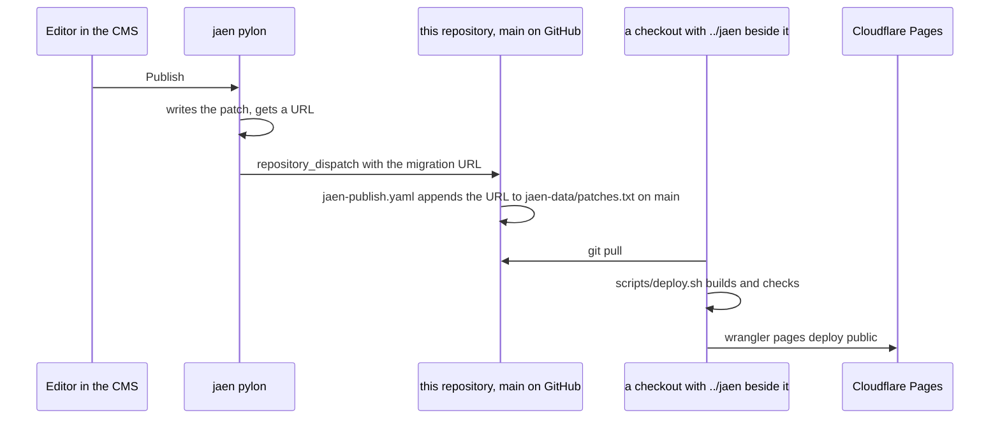

# Content

`jaen-data/patches.txt` is the site's content: one entry per line, either the URL
of a delta the CMS produced or the name of a local file in the same directory.
`gatsby-source-jaen` deep merges them **in file order**, arrays by `id`, so later
wins and the order is not decoration.

The workflow refuses a URL outside the storage gateway, skips one that is
already in the chain, and rebases on a publish that landed in between. It
does not build: see [deploy.md](deploy.md) for why. A publish is therefore
live only after somebody pulls and runs the deploy script.

Two entries are local files rather than URLs: `2025-11-30-1653-sanitised.json`
and `2025-11-30-2039-sanitised.json`. They are sanitised copies of two November
2025 publishes that carried a third client's page metadata, WIENVERS, into the
chain. The local copies keep the images and the media library and drop the
foreign metadata.

A third local file, `2026-09-05-service-images-restored.json`, is last in the
chain. The 16:53 publish of 2025-11-30 and the 20:53 one after it had replaced
the three service pictures (airport transfer, chauffeur service, city tour) on
every language page with blog images from WIENVERS; the sanitising had kept the
foreign metadata out but not the pictures. The file points the three image
fields back at the media nodes the 2025-10-02 publish uploaded, which the
library still holds, and gives `/en/` copies of the root page's nodes because it
never had its own. A later publish that touches those fields will win again,
by the file-order rule above, and then the file has to move to the end.

A local file, `2026-09-04-krc-branding.json`, was removed on 2026-09-04.
It sets every page's title and description to the sibling brand's and belongs
only in that brand's repository. It was written while both brands still came out
of one tree and stayed in this list after they were split.

## Images

Two rules that are not guessable from the code:

- **A media node belongs to one page.** `JaenPage.mediaNodes` resolves by
  filtering `MediaNode` on `jaenPageId`, so one node shared across the language
  pages is invisible to all of them and the field falls back to the placeholder
  compiled into the code. One node per page, all carrying the same URL.
- **Uploads go to `osg.netsnek.com`.** `osg.snek.at` still serves
  `/storage/<id>` and answers 404 on every other path, `/graphql` included, so
  an upload against it fails without saying so. The plugin option is
  `storageUrl`. Read every upload back and compare bytes.
