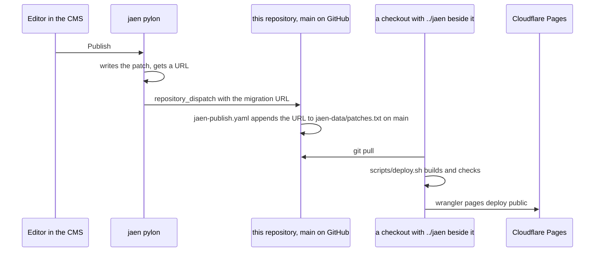

# Content

`jaen-data/patches.txt` is the site's content: one entry per line, either the URL
of a delta the CMS produced or the name of a local file in the same directory.
`gatsby-source-jaen` deep merges them **in file order**, arrays by `id`, so later
wins and the order is not decoration.

The workflow refuses a URL outside the storage gateway, skips one that is
already in the chain, and rebases on a publish that landed in between. It
does not build: see [deploy.md](deploy.md) for why. A publish is therefore
live only after somebody pulls and runs the deploy script.

Two entries are local files rather than URLs: `2025-11-30-1653-sanitised.json`
and `2025-11-30-2039-sanitised.json`. They are sanitised copies of two November
2025 publishes that carried a third client's page metadata, WIENVERS, into the
chain. The local copies keep the images and the media library and drop the
foreign metadata.

A third local file, `2026-09-05-service-images-restored.json`, is last in the
chain. The 16:53 publish of 2025-11-30 and the 20:53 one after it had replaced
four pictures on the language pages with WIENVERS images: the three service
cards (airport transfer, chauffeur service, city tour) everywhere, and the
"About us" photograph on `/`, `/tr/` and `/ar/`. The build of 2026-05, live
until 2026-09-04, had not shown them; the sanitised copies made on 2026-09-04
did, because they carried the pictures along with the media library. The file
points the four image fields back at the media nodes the 2025-10-02 publish
uploaded, which the library still holds, and gives `/en/` copies of the root
page's nodes because it never had its own. Verified against the deployment of
2026-05 image by image: every picture on the four language pages is the one
it was. The same publishes also added `fleet-*` image fields named after
WIENVERS target groups; no component reads them and they are left alone. A later publish that touches those fields will win again,
by the file-order rule above, and then the file has to move to the end.

A local file, `2026-09-04-krc-branding.json`, was removed on 2026-09-04.
It sets every page's title and description to the sibling brand's and belongs
only in that brand's repository. It was written while both brands still came out
of one tree and stayed in this list after they were split.

## Images

Two rules that are not guessable from the code:

- **A media node belongs to one page.** `JaenPage.mediaNodes` resolves by
  filtering `MediaNode` on `jaenPageId`, so one node shared across the language
  pages is invisible to all of them and the field falls back to the placeholder
  compiled into the code. One node per page, all carrying the same URL.
- **Uploads go to `osg.netsnek.com`.** `osg.snek.at` still serves
  `/storage/<id>` and answers 404 on every other path, `/graphql` included, so
  an upload against it fails without saying so. The plugin option is
  `storageUrl`. Read every upload back and compare bytes.

## The fleet cards

The cards under "Fahrzeugflotte" are the catalogue in
`src/gatsby-plugin-jaen/locales/i18nHomepage.ts` (the `fleet` entries, one
set per language, built over `FLEET_BASE` in `src/vars/limosen.tsx`), rendered
by `FleetVehicleCard` in `src/components/Content.tsx`. This brand's backend
answers `[]` on the public `fleet` query, its Car table holds no rows, so the
cards say what the catalogue says. The booking form follows the same rule
(`src/services/fleet.ts`): the backend's list wins only when it lists
something.

Every card is a button. Hover and keyboard focus raise the border in the brand
gold and show the tag `FleetBookVehicle` ("Dieses Fahrzeug buchen", in the four
languages) over the picture, and a click or Enter opens the booking modal with
the card's class and its first model already selected. The pair the card hands
over is the translated class label and the first name of its description split
at the commas, because that is what the form's two dropdowns hold: the
description is the vehicle list, so a model that should be bookable has to be
in it, and the first one is the car a click preselects. The opener is
`useBookingModal().onOpen({defaults: {carClass, carTitle}})` in
`src/services/booking.tsx`, and the modal's `defaultValues` takes the pair.

In the CMS the card is not a button. `useContentManagement().isEditing` turns
the role, the tab stop and the click off, so the editor can replace the picture
and rewrite the labels without a modal opening on every click. The picture
field is still `fleet-<name>`, keyed by the catalogue's `name`: rename a
vehicle and its CMS picture no longer applies. No publish has set one so far.

On a touch screen the tag is always visible, there is no hover to reveal it,
and `_hover` in Chakra v3 never fires there.
